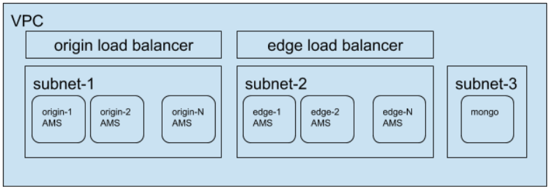

General View of AMS Cluster
---------------------------

Step 0: VPC Settings In AWS
---------------------------
*  Signup and Login to AWS
*  In AWS create VPC (Virtual Private Cloud).
*  Create 3 subnet under VPC with names subnet-1, subnet-2 and subnet-3.

.. note::
   VPC and 3 subnets are available for new user.
   
Step 1: Load Balancer Settings
------------------------------
RTMP Load Balancing

*  We will create Network Load Balancer for RTMP publishers. We must define a Listener and corresponding Target Group for each port.
*  Firstly create a Target Groups with names Origin1935
*  Set Network Load Balancer name as OriginRTMPLB
*  Add Listeners for TCP:1935
*  Choose subnet-1 as Availability Zones
*  Select Origin1935 as Target Group.
*  Finish the creation

HTTP Load Balancing

*  We will create Application Load Balancer for HTTP requests and websocket. We must define Listener and corresponding Target Group for each port.
*  Firstly create a Target Groups with names Origin5080
*  Set Network Load Balancer name as OriginHTTPLB
*  Add Listeners for HTTP:5080
*  Choose subnet-1 as Availability Zones
*  Select Origin5080 as Target Group.
*  Set as sticky
*  Finish the creation.

.. important::
   Repeat the steps for Edges by replacing Origin with Edge and subnet-1 with subnet-2.

.. note::
   We use two load balancer and we have two different addresses. Because NLB is layer 4 load balancer and we can not create sticky session. ALB is layer 7 load balancer but we can not create TCP:1935 listener. Instead of these two load balancers we could use Elastic Load Balancer (ELB) but is deprecated by AWS.
   
Step 2: Create Security Groups
------------------------------
*  Create a security group with name Mongo-Security and inbound settings:
  *  Type: SSH, Protocol: TCP, Port:22, Source: Anywhere
  *  Type: Custom TCP, Protocol: TCP, Port:27017, Source: Anywhere
*  Create a security group with name AMS-Security and inbound settings:
  *  Type: SSH, Protocol: TCP, Port:22, Source: Anywhere
  *  Type: Custom TCP, Protocol: TCP, Port:5000, Source: Anywhere
  *  Type: Custom TCP, Protocol: TCP, Port:5080, Source: Anywhere
  *  Type: Custom TCP, Protocol: TCP, Port:1935, Source: Anywhere
*  Create a security group with name OriginEdge-Sequrity and inbound settings:
  *  Type:All Traffic, Source: Anywhere
  
  .. danger::
     This will be changed.
  
Step 3: Create and Run Mongo Instance
-------------------------------------
*  Create an EC2 instance with AMS Mongo AMI
*  Select subnet-3 as subnet
*  Select Mongo-Security as security group
*  After creation note the private IP of instance. Let say it MongoIP. 

Step 4: Create Auto Scaling Launch Configuration
------------------------------------------------
*  Select AMS AMI as image
*  Set name as AMS-Cluster
*  Under Details write the followings in User Data as text:
::

  #!/bin/bash
  cd /home/ubuntu
  ./change_server_mode.sh cluster <MongoIP>
*  Select AMS-Security and OriginEdge-Security as security group

Step 5: Create Auto Scaling Group
---------------------------------
*  Select AMS-Cluster as launch configuration
*  Set name as OriginGroup
*  Select subnet-1 as subnet
*  Under Advanced Details enable Load Balancing and select origin5080 and origin1935 as target group.
*  Select min and max numbers of nodes
*  Click Scale the Auto Scaling group using step or simple scaling policies link
   - Under Increase Group Size, click add new alarm and define policy as add an instance after CPU > 80. (uncheck "Send a notification to")
   - Under Decrease Group Size, click add new alarm and define policy as remove an instance after CPU < 10. (uncheck "Send a notification to")
*  Repeat steps for EdgeGroup
*  After create Group AMS instances start to work.

Step 6: Test
------------
*  Login Management console over Origin or Edge Load Balancer Ip
*  Check the cluster page
*  Publish a stream to OriginLB Ip
*  Play the stream from EdgeLB Ip
