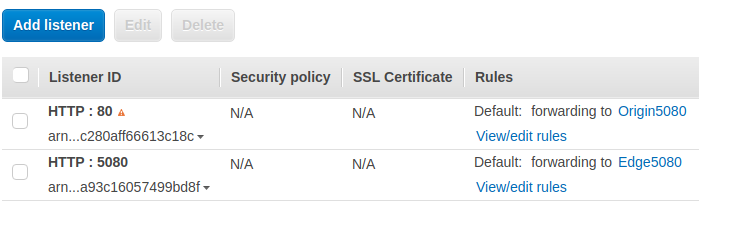

General View of AMS Cluster
---------------------------

.. figure:: img/AMS-cluster-overview.png
   :alt: AMS Cluster Overview

Step 0: VPC Settings In AWS
---------------------------
*  Signup and Login to AWS
*  In AWS create VPC (Virtual Private Cloud).
*  Create 3 subnet under VPC with names subnet-1, subnet-2 and subnet-3.

.. note::
   VPC and 3 subnets are available for new user.
   
.. tip::
   You can look at `AWS Documentation <https://docs.aws.amazon.com/vpc/latest/userguide/VPC_Subnets.html>`__ for details about VPCs.

Step 1: Create Security Groups
------------------------------
*  Get IPv4 CIDR using VPC from VPC list. It is like as 172.31.0.0/16. Let say it VPC_CIDR.
*  Create a security group with name Mongo-Security and inbound settings:
  *  Type: SSH, Protocol: TCP, Port:22, Source: Anywhere
  *  Type: Custom TCP, Protocol: TCP, Port:27017, Source: VPC_CIDR
*  Create a security group with name AMS-Security and inbound settings:
  *  Type: SSH, Protocol: TCP, Port:22, Source: Anywhere
  *  Type:All Traffic, Source: VPC_CIDR (Actually this is enough)
*  Create a security group with name WebRTC-Security and inbound settings:
  *  Type: Custom UDP, Protocol: UDP, Port:X-Y, Source: Anywhere
*  Create a security group with name LB-Security and inbound settings:
  *  Type: Custom TCP, Protocol: TCP, Port:5080, Source: Anywhere  (for unsecure connection)
  *  Type: Custom TCP, Protocol: TCP, Port:5443, Source: Anywhere  (for secure connection SSL) 
  *  Type: Custom TCP, Protocol: TCP, Port:1935, Source: Anywhere
  
.. tip::
   You can look at `AWS Documentation <https://docs.aws.amazon.com/AWSEC2/latest/UserGuide/using-network-security.html?icmpid=docs_ec2_console>`__ for details about Security Groups.

Step 2: Load Balancer Settings
------------------------------
HTTP Load Balancing

*  We will create Application Load Balancer for HTTP requests and websocket. We must define Listener and corresponding Target Group for each port.
*  Cirstly create a Target Groups with names Origin5080, protocol HTTP and port 5080
*  Create a Target Groups with names Egde5080, protocol HTTP and port 5080
*  After creation select groups, click set atributes the enable stickeness.

.. tip::
   You can look at `AWS Documentation <https://docs.aws.amazon.com/elasticloadbalancing/latest/application/load-balancer-target-groups.html>`__ for details about Target Groups.

*  Set Network Load Balancer name as OriginHTTPLB
*  For origins add Listener for HTTPS:443 (or if you don't need SSL then HTTP:80)
*  For edges add Listeners for HTTPS:5443 (or if you don't need SSL then HTTP:5080)
*  Choose subnet-1 and subnet-3 as Availability Zones
*  Fill the SSL Certificate informations. (if you don't need SSL then skip this step)
*  Select Origin5080 as Target Group.
*  Select LB-Security as Security Group.
*  Finish the creation.

.. warning::
   We have one more step. Both listeners are forwarded to Origin5080. We forward 5443 (or 5080) listener to Edge5080. Select created load balancer under Listeners tab edit the 5443 (or 5080) listener as forward to Edge5080. 
   
   Before:
   
   .. figure:: img/lb-forwarding-1.png
      :alt: AMS Cluster LB before
    
   After:
   
   .. figure:: img/lb-forwarding-2.png
      :alt: AMS Cluster LB after
        
.. tip::
   You can look at `AWS Documentation <https://docs.aws.amazon.com/elasticloadbalancing/latest/application/application-load-balancer-getting-started.html>`__ for details about Application Load Balancers.        
    
Step 3: Create and Run Mongo Instance
-------------------------------------
*  Create an EC2 instance with AMS Mongo AMI
*  Select subnet-3 as subnet
*  Under Details write the following in User Data as text:
::

   sudo service mongod start
*  Select Mongo-Security as security group
*  After creation note the private IP of instance. Let say it MongoIP.

.. tip::
   You can look at `AWS Documentation <https://docs.aws.amazon.com/efs/latest/ug/gs-step-one-create-ec2-resources.html>`__ and `this <https://aws.amazon.com/premiumsupport/knowledge-center/launch-instance-custom-ami>`__ for details about launching an instance using AMI.      

Step 4: Create Auto Scaling Launch Configuration
------------------------------------------------
*  Select AMS AMI as image
*  Set name as AMS-Cluster
*  Under Details write the followings in User Data as text:
::

  #!/bin/bash
  cd /home/ubuntu
  ./change_server_mode.sh cluster <MongoIP>
  

      
*  Select AMS-Security and WebRTC-Security as security group

.. tip::
   You can look at `AWS Documentation <https://docs.aws.amazon.com/autoscaling/ec2/userguide/create-launch-config.html>`__  for details about Auto Scaling Launch Configuration.    

Step 5: Create Auto Scaling Group
---------------------------------
*  Select AMS-Cluster as launch configuration
*  Set name as Origins
*  Select subnet-1 as subnet
*  Under Advanced Details enable Load Balancing and select Origin5080 as target group.
*  Select min and max numbers of nodes
*  Click Scale the Auto Scaling group using step or simple scaling policies link
   - Under Increase Group Size, click add new alarm and define policy as add an instance after CPU > 80. (uncheck "Send a notification to")
   - Under Decrease Group Size, click add new alarm and define policy as remove an instance after CPU < 10. (uncheck "Send a notification to")
 

   
*  Repeat steps for Edges
*  After create Group AMS instances start to work.

.. tip::
   You can look at `AWS Documentation <https://docs.aws.amazon.com/autoscaling/ec2/userguide/create-asg.html>`__  for details about Auto Scaling Group. 

Step 6: Test
------------
*  Login Management console over Load Balancer
*  Check the cluster page
*  Publish a stream to Origin
*  Play the stream from Edge

RTMP Load Balancing (Optional)
------------------------------
*  If we want to use RTMP publishing, we will create Network Load Balancer for RTMP publishers. We must define a Listener and corresponding Target Group for each port.
*  Firstly create a Target Groups with name Origin1935, protocol TCP and port 1935
*  Set Network Load Balancer name as OriginRTMPLB
*  Add Listeners for TCP:1935
*  Choose subnet-1 as Availability Zones
*  Select Origin1935 as Target Group.
*  Finish the creation
