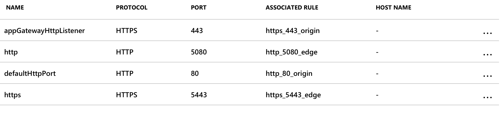
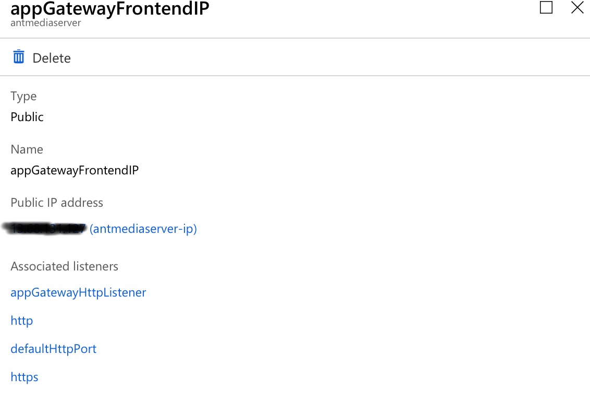
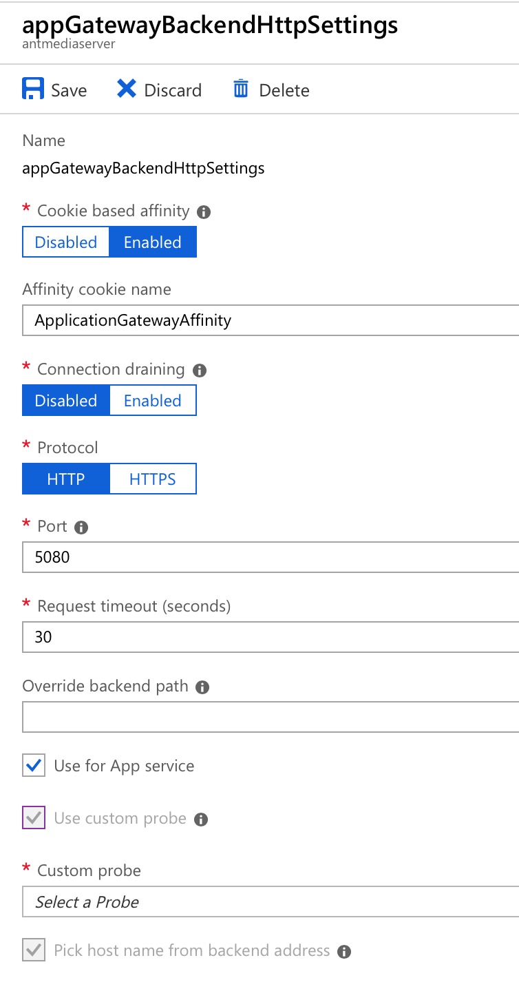
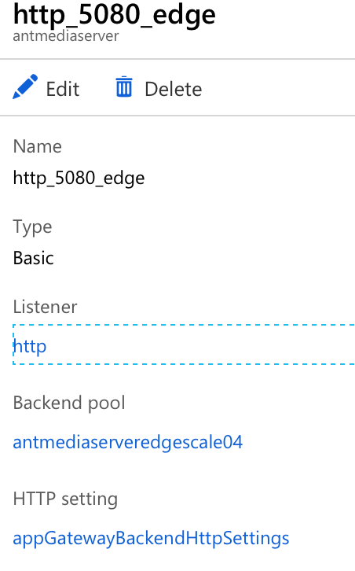
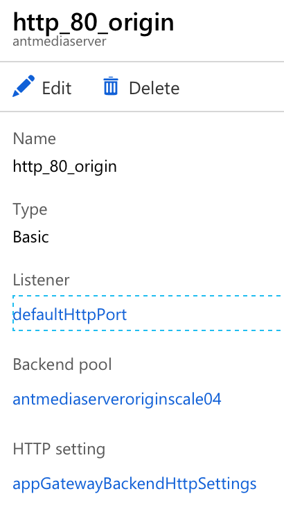
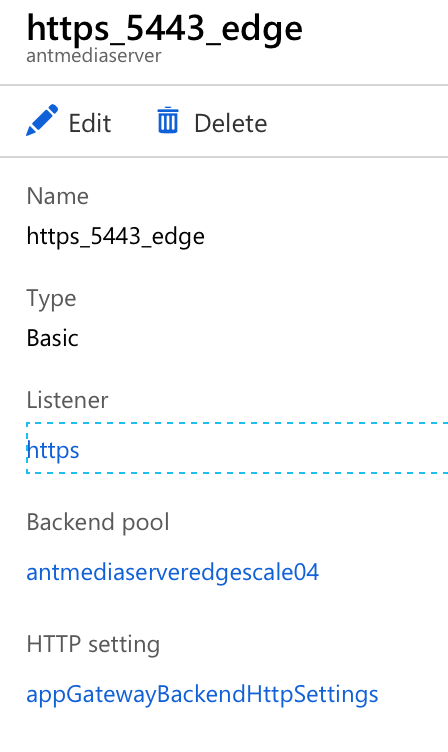
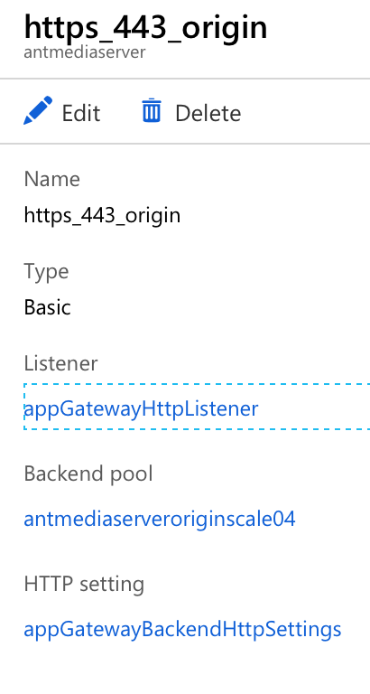

Clustering with Azure
---------------------
This document is a guide for setting up clustering in Azure platform.

| **Requirements:**
| Having an Azure account and a ready AntMedia Server Image.
|
| Architecture of cluster setup could be found `here <Test-Environment.rst>`_.
| Introduction to clustering with Antmedia Serve could be found `here <Clustering.rst>`_.

Step 1: Create a Virtual network
--------------------------------
Firstly, we need to create a virtual network named antmediaserver,
and then we will add origin-subnet and edge-subnet as described in this
`doc <https://docs.microsoft.com/en-us/azure/virtual-network/create-virtual-network-classic>`_.

Step 2: Create a Public IP
--------------------------
Create a static public IP address described as
`here <https://docs.microsoft.com/en-us/azure/virtual-network/virtual-network-public-ip-address>`_. Name it antmediaserver-ip.

Step 3: Create a Storage Account
--------------------------------
Create a storage account as described
`here <https://docs.microsoft.com/en-us/azure/storage/common/storage-quickstart-create-account?tabs=azure-portal>`_.
Name it mediastorage.

Step 4: Create a MongoDB Virtual Machine
----------------------------------------
Create a virtual machine with MongoDB as described
`here <https://github.com/ant-media/Ant-Media-Server/wiki/DB-Based-Clustering-(available-for-v1.5.1-and-later)-and-Autoscaling>`_.

Step 5: Create a Virtual Machine for AntMedia
---------------------------------------------
1. In All Resources, select your AntMedia image and click Create VM in the upper bar.
2. In Basic tab
   - Enter virtual machine name.
   - Enter your SSH public key if the authentication type is SSH public key.
   - Select a VM size.
3. Skip Disks tab.
4. In Networking tab:
   - Select antmediaserver as virtual network.
   - Select edge-subnet as a Subnet.
   - Select the antmediaserver-ip public ip address which is created before.
5. In Management tab:
   - Select your diagnotics Storage account which is mediastorage.
6. Skip other tabs and click Create and create a virtual machine.

Step 6: Setup AntMedia in VM
----------------------------
.. warning::Be aware that it may take some time for the new VM to start up.
1. In All resources, click the VM that you created and note the public IP address.
2. We need to open port 22 for connecting with ssh. In networking section, click Add inbound port. Enter 22 for Destinations port ranges. Select Any as protocol. Enter 100 as Priorty. Give a name such as Port_22.
3. Open port 5080 similar to opening the port 22, but select TCP as protocol and priority as 200.
4. Use ssh and connect to this VM.
5. Download the AntMedia Server zip file and setup using this
`script <https://raw.githubusercontent.com/ant-media/Scripts/master/install_ant-media-server.sh>`_.
6. Run this script https://raw.githubusercontent.com/ant-media/Scripts/master/change_server_mode.sh
sudo ./change_server_mode.sh cluster <MONGO_SERVER_IP> where MONGO_SERVER_IP is the private IP
and can be learnt from MongoDB server in All Resources. Now server will start in cluster mode.

Step 7: Create Scale Sets
-------------------------
1. We need to setup scale sets. We need an image for this. So go to VM that you created and click Capture. Enter a name and select the resource group that you created before.
2. Click Create a Resource which is on the top left and search for virtual machine scale set. Select virtual machine scale set in the list and click create.
3. Create edgescale scale set:
   - Enter a scale set name "edgescale".
   - Set Availability zone to None.
   - Set username.
   - Set SSH public key.
   - Set instance count to minimum number that you need.
   - Select a VM size.
   - Enable AutoScale with min and max instance numbers.
   - Select Application Gateway as load balancer.
   - Select edge-subnet as subnet which is created before.
   - Enable public IP address per instance.
   - Click create.
4. Create a scale set for origin:
   - Enter a scale set name "originscale"
   - Click browse all images and in my items tab select the image that you created.
   - Set username.
   - Set SSH public key.
   - Set instance count to 1.
   - Select a VM size.
   - Enable AutoScale with min and max instance numbers.
   - Select Application Gateway as load balancer.
   - Select origin-subnet as subnet which is created before.
   - Enable public IP address per instance.
   - Click create.

Step 8: Create Application Gateway
----------------------------------
Create an Application Gateway described as
`here <https://docs.microsoft.com/en-us/azure/application-gateway/quick-create-portal>`_. Application Gateway will be the load balancer.

1. Click Listeners and create listeners as seen below:

2. Click Frontend IP configuration and create public IP configuration as seen below:

3. Click HTTP Settings and add a new one as seen below:

4. Click Rules.
5. Create http_5080_edge as seen below:

6. Create http_80_origin as seen below:

7. Create https_5443_edge as seen below:

8. Create https_443_origin as seen below:

This completes the setup.
