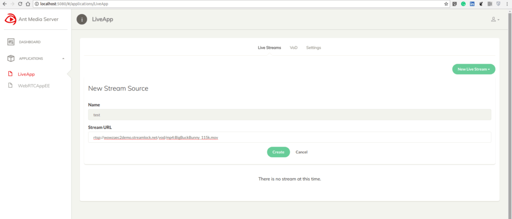
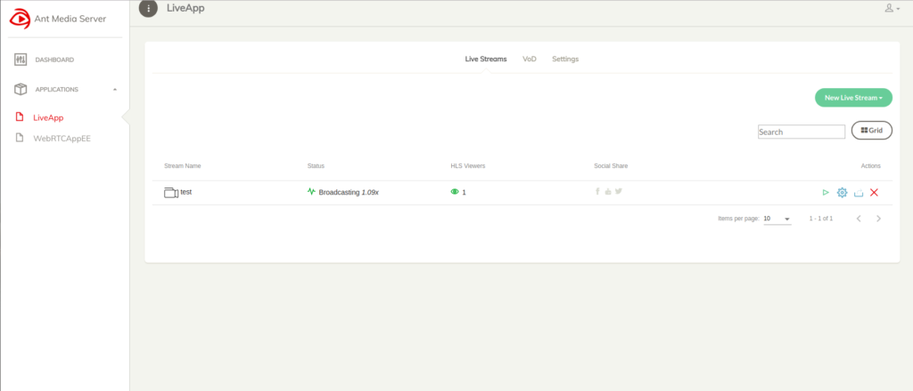
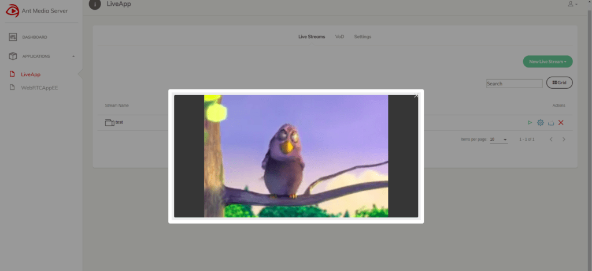

Ant Media Server operates with different streaming flows. As well as accepting and creating streaming media, it also has the capability of the pull live streams from external sources. Such as; live TV streams, IP camera streams or other forms of live streams(RTSP, HLS, TS, FLV etc.).  We will first show how to pull live streams with Web Interface and then we will give technical details for developers.

Pull Live Streams with Web Interface
------------------------------------
First, log in to the management panel. Click New Live Stream -> Stream Source. Define stream name and URL.

Then, Ant Media Server starts to pull streams.

Now, you can watch it.

Technical Details about Pulling Live Streams for Developers
-----------------------------------------------------------
There are 2 classes to operate and regulate pulling processes:

1. **StreamFetcher.java:** Includes operating methods, startStream, stopStream, prepare etc
2. **StremFetcherManager.java:** Includes regulating methods such as checkStreamFetchersStatus,  restartStreamFetchers,  setRestartStreamAutomatically,  scheduleStreamFetcherJob etc.

1. Initialize StreamFetcherManager
----------------------------------
.. code:: Java

    /* Constructor */
    public StreamFetcherManager(ISchedulingService schedulingService, IDataStore datastore,IScope scope) {
    	this.schedulingService = schedulingService;
    	this.datastore = datastore;
    	this.scope=scope;
    }

    streamFetcherManager = new StreamFetcherManager(AntMediaApplicationAdapter.this, dataStore,app);

2. Define Settings
------------------
.. code:: Java

    streamFetcherManager.setRestartStreamFetcherPeriod(appSettings.getRestartStreamFetcherPeriod());
    streamFetcherManager.setStreamCheckerInterval("seconds"));

A developer can define restart parameter. This is stored in the settings file as  ” settings.streamFetcherRestartPeriod” (in seconds) by using setRestartStreamFetcherPeriod() method. If this parameter set as 0, stream fetcher will never restart in other words never save the fetched stream. For example, define this parameter to “1800” to save fetched stream as recorded video in every 30 minutes. Also, make sure that “Enable MP4 Recording” option enabled in the management panel or “settings.mp4MuxingEnabled ” parameter in the setting file set to true to save the video.

Another parameter is StreamCheckerInterval. This defines the time interval for StreamFetcherManager should check all fetching processes whether they continue to fetch properly or not. The default parameter is 10 seconds. The checkStreamFetchersStatus() method performs these controls.

3. Start Streaming
------------------
.. code:: Java

    streamFetcherManager.startStreams(streams);

The parameter “streams” is a list (List<Broadcast> streams) of broadcast objects to be fetched.

4. Customize
------------
You can also customize the required parameters in StreamFetcher class according to your project’s needs and requirements.

**connection timeout:**  (defined as “timeout” in ms) Connection timeout interval during connection establishment to the stream source in the first phase.

**packet receiving timeout:** (defined as “PACKET_RECEIVED_INTERVAL_TIMEOUT” in ms) Checks incoming packets timestamps and defines stream is alive or not.

**restart after disconnection:** (defined as “restartStream” as boolean) If defined as true, tries to reconnect stream source immediately after disconnected.

**buffer time:** (defined as “bufferTime” in ms) Stream Fetcher first buffers received packets then restreams for smooth streaming but of course it creates a small delay.
