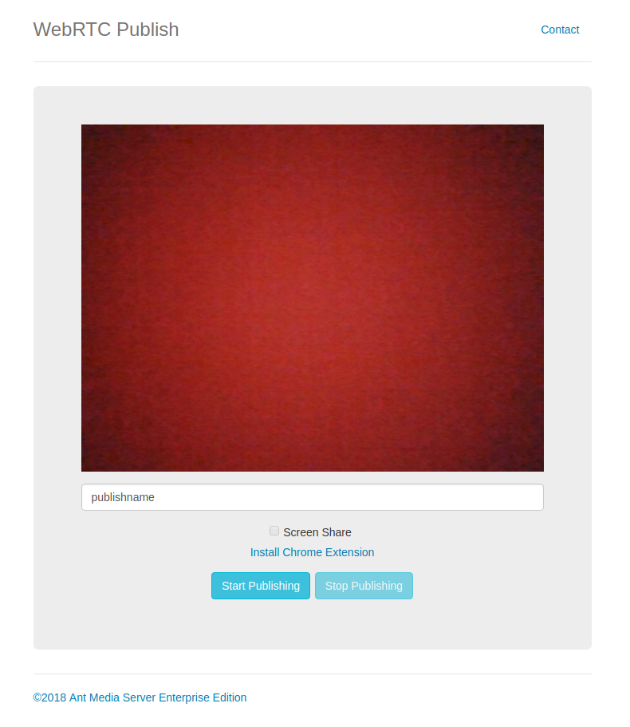
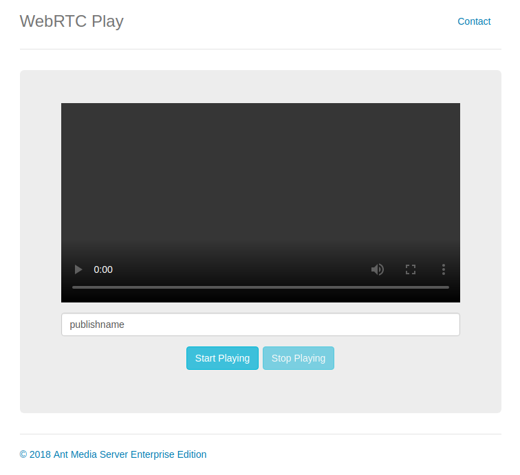
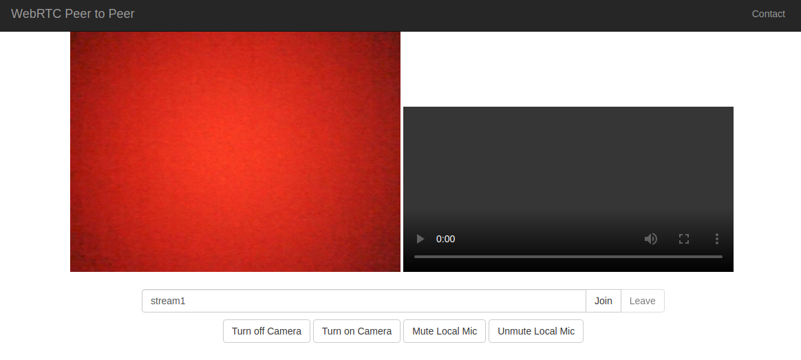
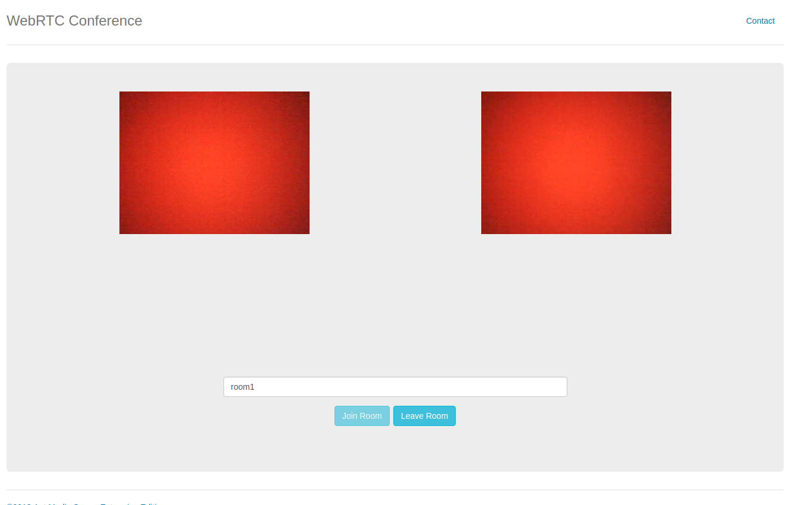

###################
Streaming Protocols
###################

Throughout this document we use AMS_URL for ``http(s)://<AMS_Host>:<Port>``.
By default AMS Port is ``5080`` for http and ``5443`` for https.

WebRTC
======
Publishing
----------
To stream your camera with name <stream_name> to the Ant Media Server, you can open the following URL from your browser then click publish button.

``<AMS_URL>:WebRTCAppEE/index.html?name=<stream_name>``

Playing
-------
To play a stream with name <stream_name> from Ant Media Server, you can open the following URL from your browser then click play button.

``<AMS_URL>:WebRTCAppEE/player.html?name=<stream_name>``

If you want to start playing when stream is available, you can open following URL.

``<AMS_URL>:WebRTCAppEE/play_embed.html?name=<stream_name>``

Peer-to-peer
------------
If you want to use Ant Media Server for a signalling server you open following URL.

``<AMS_URL>:WebRTCAppEE/peer.html?name=<stream_name>``

Conference
----------
If you want to use Ant Media Server for a multiuser conference, you open following URL.

``<AMS_URL>:WebRTCAppEE/conference.html``

WebRTC Screen Sharing
---------------------
.. include:: WebRTC-Screen-Sharing.rst

RTMP
====
Publishing
----------
To stream your media with name <stream_name> to the Ant Media Server, you can use the following URL.

``rtmp://<AMS_Host>/<App_Name>/<stream_name>``

There are many ways to publish Live Stream with RTMP to Ant Media server. Here are the some of the ways:

Publish with a Desktop Software
~~~~~~~~~~~~~~~~~~~~~~~~~~~~~~~

.. include:: Publish-with-a-Desktop-Software---Open-Broadcaster-Software.rst

Publish with a Hardware Encoder
~~~~~~~~~~~~~~~~~~~~~~~~~~~~~~~
.. include:: Publish-with-a-Hardware-Encoder---Teradek-Vidiu-Pro.rst

Publish with a Mobile Application
~~~~~~~~~~~~~~~~~~~~~~~~~~~~~~~~~
.. include:: Publish-with-a-Mobile-App-Android.rst

Playing
-------
To play a stream with name <stream_name> from Ant Media Server, you can play the following URL.

``rtmp://<AMS_Host>/<App_Name>/<stream_name>``

HLS
===
.. include:: Play-Live-and-VoD-Streams-and-Previews.rst

Low Latency WebRTC Live Streaming
=================================

.. include:: Try-Low-Latency-WebRTC-Live-Streaming.rst

Low Latency Publish with RTMP & Play with WebRTC
================================================

.. include:: Publish-with-RTMP-&-Play-with-WebRTC.rst

